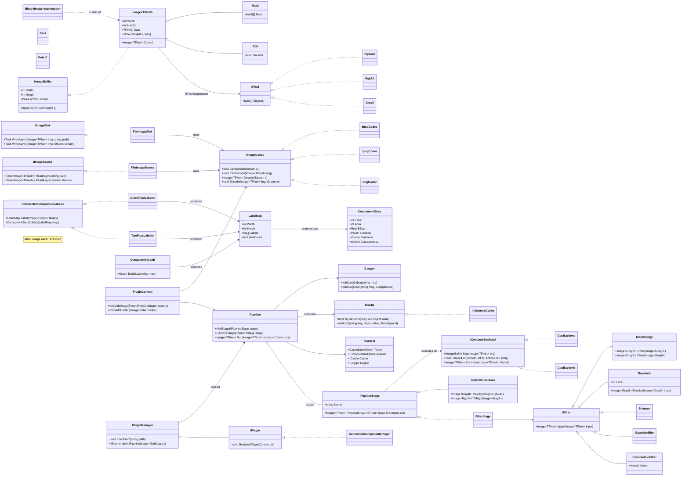

# Bildbearbeitung – UML-Klassendiagramm (mit Connected Components & Schnittstellen)

Dieses Dokument zeigt eine modulare Architektur für eine Bildbearbeitungsbibliothek. Im Fokus stehen klare Schnittstellen, eine erweiterbare Pipeline, verbundene Komponenten (Connected Components) sowie die Trennung von I/O, Rechen-Backends und Erweiterungen.

Hinweis: Das Diagramm ist technologie-agnostisch und kann in C#, Java, TypeScript u. a. umgesetzt werden. Typparameter wie `Image<TPixel>` sind generisch gedacht.

## Klassendiagramm (Mermaid)

## Anmerkungen zur Architektur
- Trennung der Verantwortlichkeiten: Core-Bildtypen, I/O, Verarbeitung (Pipeline), Analyse (Connected Components), Compute-Backends und Erweiterbarkeit (Plugins).
- `Pipeline` orchestriert eine Liste von `IPipelineStage` und ermöglicht flexible Verarbeitungsketten. Caching/Logging sind zentral eingebunden über `Context`.
- Connected Components werden über eine `IConnectedComponentLabeler`-Schnittstelle abstrahiert, mit austauschbaren Implementierungen (z. B. Two-Pass, Union-Find). Statistiken und ein Komponenten-Graph sind getrennte Concern.
- `IComputeBackend` ermöglicht CPU- oder GPU-Implementierungen ohne Änderung der Algorithmen-Schnittstellen.
- I/O ist über `IImageSource`/`IImageSink` und `IImageCodec` flexibel erweiterbar; zusätzliche Formate können als Plugins geliefert werden.

## Mögliche Sequenz (Beispiel)
1. `FileImageSource.ReadAsync(path)` liest ein Bild und nutzt dafür einen passenden `IImageCodec`.
2. `Pipeline.Run(image, ctx)` führt nacheinander Stages aus: `ColorConversion -> Threshold -> Morphology`.
3. Das Ergebnis (binär) wird an `IConnectedComponentLabeler.Label(...)` übergeben; `Stats` werden berechnet und optional `ComponentGraph` erstellt.

## Hinweise zur Nutzung
- Du kannst dieses Diagramm in VS Code in der Markdown-Vorschau anzeigen. Mermaid wird von vielen Renderern unterstützt.
- Die Klassen- und Methodensignaturen sind als API-Vorschlag zu verstehen und können an deine Sprache/Runtime angepasst werden (z. B. Generics, Sync/Async, ValueTypes).
